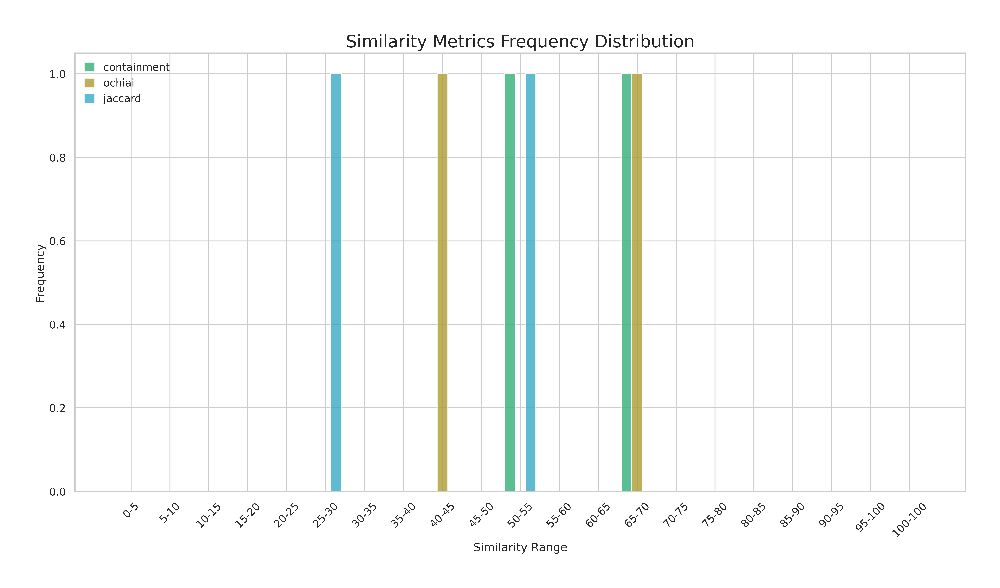
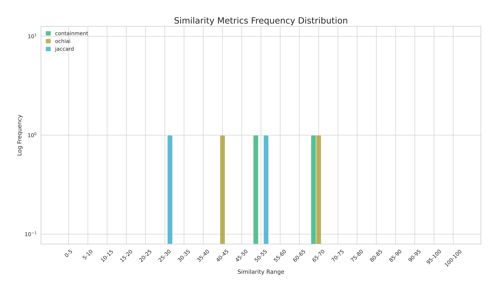
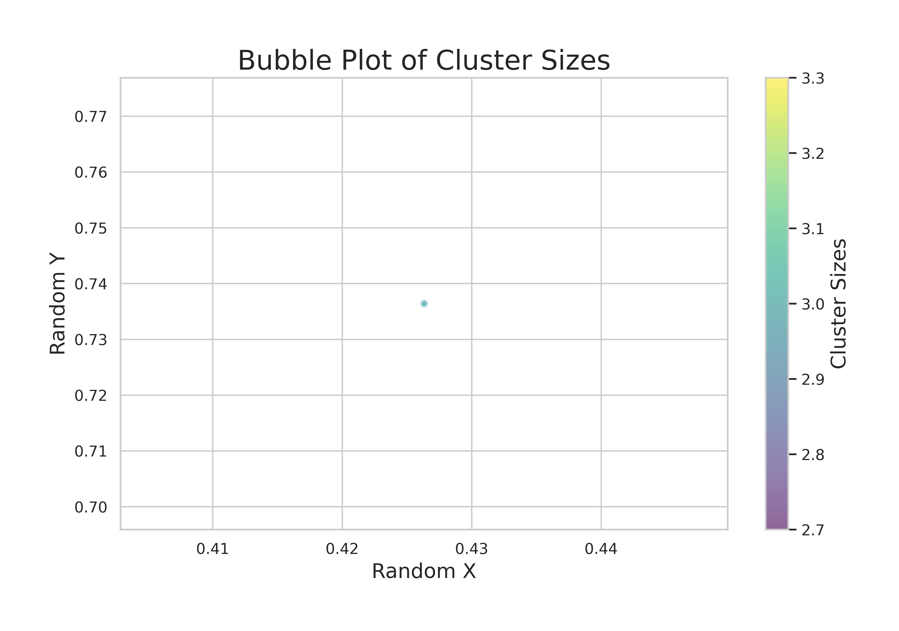
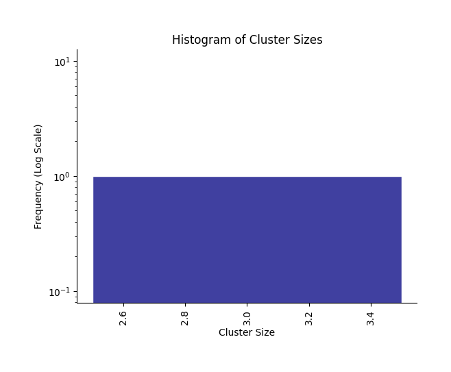

# **DBRetina Analysis Output**  

This repository contains the results of the analysis I performed using **DBRetina**. The analysis involved **indexing**, **pairwise similarity analysis**, and **clustering** to explore genomic data.  

## **Sample Data Used**  
- I used **[sample_data.tsv]** as input for this analysis.  
- The data was processed using DBRetina to generate similarity metrics, cluster information, and visual representations.  

---

## **Output Overview**  

### **Indexing**  
- The `Index` folder contains indexed data generated from the input using the `dbretina index` command.  
- These files are essential for performing pairwise similarity calculations and clustering.  

---

### **Pairwise Analysis**  
- The `Pairwise-Analysis` folder includes results from the `dbretina pairwise` function.  
- It contains similarity scores between gene sets, statistical data, and odds ratio analysis.  
- The analysis results are also visualized using various similarity metrics.  

#### **Similarity Metrics Visualization**  
- **Linear Scale Plot:**  
  

- **Log Scale Plot:**  
  

---

### **Clustering**  
- The `Clustering` folder contains results from the `dbretina cluster` function.  
- It provides detailed cluster assignments, visual representations of cluster distributions, and additional cluster insights.  

#### **Cluster Visualizations**  
- **Cluster Bubble Plot:**  
  

- **Cluster Histogram:**  
  

---

### **Features**  
- The `Features` folder contains additional insights into genomic features used in the analysis.  
- These files provide detailed information on feature-level data and counts.  

---

## **Note**  
- The outputs in this repository were generated using sample data for analysis purposes.  
- No sensitive or private data is included.  

